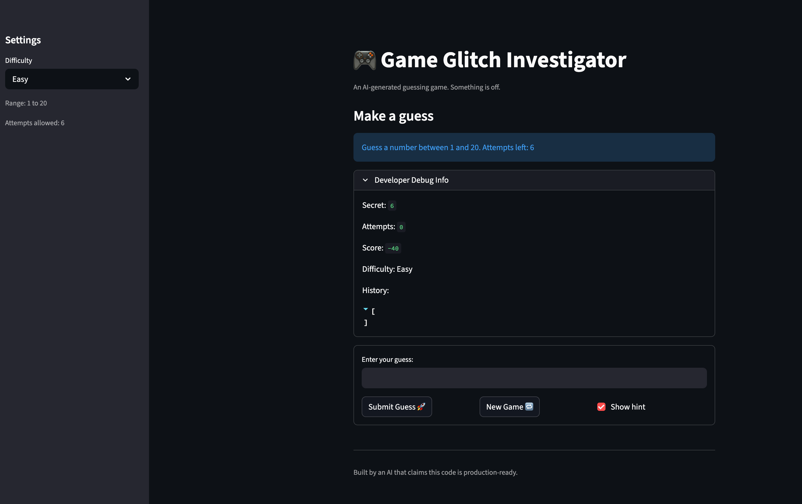

# 🎮 Game Glitch Investigator: The Impossible Guesser

## 🚨 The Situation

You asked an AI to build a simple "Number Guessing Game" using Streamlit.
It wrote the code, ran away, and now the game is unplayable. 

- You can't win.
- The hints lie to you.
- The secret number seems to have commitment issues.

## 🛠️ Setup

1. Install dependencies: `pip install -r requirements.txt`
2. Run the broken app: `python -m streamlit run app.py`

## 🕵️‍♂️ Your Mission

1. **Play the game.** Open the "Developer Debug Info" tab in the app to see the secret number. Try to win.
2. **Find the State Bug.** Why does the secret number change every time you click "Submit"? Ask ChatGPT: *"How do I keep a variable from resetting in Streamlit when I click a button?"*
3. **Fix the Logic.** The hints ("Higher/Lower") are wrong. Fix them.
4. **Refactor & Test.** - Move the logic into `logic_utils.py`.
   - Run `pytest` in your terminal.
   - Keep fixing until all tests pass!

## 📝 Document Your Experience

- [X] Describe the game's purpose.
   - Its a game where the user needs to guess a number between different ranges depending on the difficulty level.
- [X] Detail which bugs you found.
   - The hints are not right. They are showing arbitary.
    - The attempt left on the top did not match the actual attempts left.
    - When the hints are shown, adding a new number and clicking on submit, first cleared the hint and then I had to click on submit again to the value to be considered as my new answer.
    - Clicking on new game did not clear the previous outputs and state. Due to this even when I clicked on New Game, I was unable to actually play.
    - In the input box, it says 'Enter to apply', but the enter button doesn't work.
- [X] Explain what fixes you applied.
    - Submit works as expected
    - Stable secret number
    - New game resets all the states

## 📸 Demo

## 🚀 Stretch Features

- [ ] [If you choose to complete Challenge 4, insert a screenshot of your Enhanced Game UI here]
